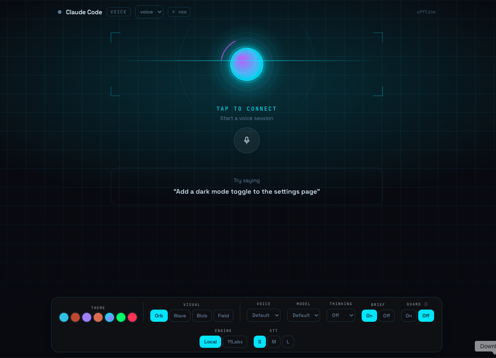

# claude-voice-code (`cvc`)

Talk to **Claude Code** by voice — naturally, two-way, with barge-in — from your
**terminal** or a **web UI**.

<p align="center">
  
</p>

`cvc` bridges to a normal, already-authenticated `claude` running in a tmux
session. Your speech is transcribed and injected into the session as if typed,
and Claude's reply is read straight from the session transcript and spoken back
— **streamed sentence by sentence** so you hear the first words while the rest is
still being written. A turn-taking state machine (`idle → listening → thinking →
speaking`) ties it together, with **barge-in**: start talking while it speaks and
it stops to listen.

Speech runs **offline** (sherpa-onnx: Whisper STT + Kokoro TTS + Silero VAD) or
via **ElevenLabs** — switchable per side, even live from the web UI.

```
you ──speak──▶ STT (Whisper / Scribe) ──▶ inject into tmux `claude` (paste + Enter)
                                                  │
                                                  ▼
you ◀─hear──── TTS (Kokoro / ElevenLabs) ◀── read reply from the session JSONL
```

## Features

- **Two-way voice** with **barge-in** — talk over the agent and it yields.
- **Two front-ends** — a terminal client (push-to-talk or hands-free) and a web
  UI with an audio-reactive orb.
- **Local or cloud, per side** — offline sherpa-onnx (free, no key) or ElevenLabs,
  switch STT and TTS independently.
- **Streaming replies** — speaks each sentence as Claude writes it; first audio in
  ~1 s, models warmed at connect so the first turn isn't cold.
- **Guard mode** *(opt-in)* — a spoken confirmation gate for risky tool calls
  (e.g. `rm`, `git push`, any MCP tool): it asks out loud and waits for your "yes".
- **Brief mode** and **thinking levels** (think / think-hard / ultrathink),
  toggled per session.
- **Latency HUD** — per-turn breakdown (STT · think · first-audio · total) so you
  can tune engines and models by ear *and* by number.
- **Web console** — 7 themes, 4 visualizers (Orb / Wave / Blob / Field), and live
  switchers for engine, Whisper size (S/M/L), voice, model, thinking, Brief, Guard.

## Quickstart

```bash
npm install
npm run cvc -- setup          # install tmux, download offline models, write config
npm run cvc -- doctor         # verify your environment

# Terminal voice:
npm run cvc -- start          # open a Claude session and start talking

# Web UI:
npm run web:build
npm run cvc -- serve          # then open the printed URL (http://127.0.0.1:5173)
```

Install the `cvc` command globally with `npm i -g .` (or `npm link`) from the repo
root, then use `cvc setup`, `cvc start`, `cvc serve`, … directly.

## Requirements

- macOS or Linux, **Node ≥ 20** (developed on 24)
- **tmux** — installed for you by `cvc setup` (or `brew install tmux`)
- **sox** — mic capture & playback for the terminal client (`brew install sox`)
- A logged-in **`claude`** (Claude Code) on your `PATH` — `cvc start` launches one
- For cloud speech only: an **`ELEVENLABS_API_KEY`**

Offline speech needs no API key; `cvc setup` downloads the models (Silero VAD,
Whisper, and Kokoro — int8 Kokoro is ~103 MB, fp32 ~320 MB) into
`~/.cache/claude-voice-code/models`.

## Commands

| Command | What it does |
|---|---|
| `cvc setup` | Install tmux, download offline models, write `cvc.config.jsonc` |
| `cvc doctor [--mic]` | Check node/tmux/claude/sox/models/api-key (and mic with `--mic`) |
| `cvc start [--attach <s>]` | Ensure a Claude tmux session (launch claude), then talk |
| `cvc talk [--open-mic]` | Terminal voice loop (push-to-talk; `--open-mic` for hands-free) |
| `cvc serve [--port N]` | Start the web UI server (browser, WebRTC) |
| `cvc say -m "…" [--out f.wav]` | Speak text via the configured TTS (smoke test) |
| `cvc inject -m "…"` | Send text to Claude and print the reply (no audio) |
| `cvc download-models [--only …] [--hifi] [--force]` | Fetch offline speech models |

**Terminal push-to-talk:** press `SPACE` to open the mic, speak, then pause — your
turn is sent automatically; `SPACE` again mutes; `Ctrl-C` quits. `--open-mic` keeps
the mic live (use headphones — the terminal has no echo cancellation).

**Web UI:** click the mic to connect, then just talk (the browser provides echo
cancellation, so barge-in works on speakers). All controls live in the bottom dock
— theme, visualizer, engine (Local / 11Labs), Whisper size, voice, model, thinking
level, Brief, and Guard.

## Guard mode (spoken tool confirmation)

Off by default. When you flip **Guard** on, `cvc` launches `claude` with a
`PreToolUse` hook (via `claude --settings <generated file>`, so your projects are
never modified). Before a risky tool runs — any MCP tool, destructive Bash like
`rm` / `git push` / `dd`, or writes to sensitive paths — the hook asks `cvc` over a
local Unix socket, which **speaks the request and waits for a spoken yes/no**. It is
**fail-closed**: anything that isn't a clear "yes" denies. Guard is the only mode
that pairs with `--dangerously-skip-permissions`, so you trade Claude Code's typed
prompts for voice ones rather than removing the gate.

## How it works

- **The bridge.** Inject a turn with `tmux load-buffer → paste-buffer → send-keys
  Enter`. Read the reply by polling the JSONL Claude writes to
  `~/.claude/projects/<cwd>/` (the cwd with every `/` and `.` turned into `-`). The
  reply is keyed to *our* injected message, so it's correct even when other Claude
  sessions share the project dir; barge-in sends `Escape`.
- **STT.** Local: Silero VAD endpoints an utterance, then offline Whisper
  (`small.en` by default) transcribes the whole thing. Non-speech noise tokens
  (`[BLANK_AUDIO]`, `(buzzing)`, …) are stripped so they never reach Claude. Cloud:
  a light energy gate + ElevenLabs `/speech-to-text` (Scribe).
- **TTS.** Local: Kokoro (24 kHz), streamed in small chunks so the first words play
  fast. Cloud: ElevenLabs HTTP streaming. Audio is mono s16 throughout; resampling
  lives in one place.
- **Transport.** The web client uses **WebRTC** (werift + Opus) purely so the
  browser gives us **acoustic echo cancellation** — without it, the agent's TTS
  feeds back into the mic. A 20 ms pacer streams TTS out and keeps the track warm.
- **Gateway.** A pure turn-state reducer (`packages/core/src/gateway/turnState.ts`)
  decides transitions + effects (inject / cancelTTS / interruptAgent); the gateway
  runs them, streaming the reply through a per-turn TTS queue and cancelling the
  in-flight reply + audio on barge-in.

## Configuration

Copy `cvc.config.example.jsonc` → `cvc.config.jsonc` and edit (`cvc setup` does this
for you). Precedence: **CLI flag > env var > config file > built-in default.**

| Key | Env | Default | Notes |
|---|---|---|---|
| `stt` / `tts` | `CVC_STT` / `CVC_TTS` | `local` | `local` \| `elevenlabs` \| `off` |
| `elevenlabs.apiKey` | `ELEVENLABS_API_KEY` | — | required for cloud engines |
| `models.dir` | `CVC_MODELS_DIR` | `~/.cache/claude-voice-code/models` | offline models |
| `models.whisper` | — | `sherpa-onnx-whisper-small.en` | STT model dir (S/M/L in the UI) |
| `claudeBin` | `CLAUDE_BIN` | `claude` | binary `cvc start` launches |
| `tmux.session` | `CVC_TMUX_SESSION` | `cvc-voice` | managed session name |
| `tmux.cwd` | `CVC_CLAUDE_CWD` | current dir | Claude's working dir |
| `tmux.attach` | `CVC_TMUX_ATTACH` | — | bind an existing session instead |
| `reply.summarize` | — | `false` | speak a short excerpt of long replies |
| `server.port` / `server.host` | `CVC_PORT` / `CVC_HOST` | `5173` / `127.0.0.1` | |

Threads for the local models default to `4`; set `CVC_NUM_THREADS` higher on a
many-core machine for faster decode/synthesis.

## Project layout

```
packages/core    speech providers, the tmux bridge, the turn-taking gateway (shared)
packages/server  WebRTC transport + WS signaling + static host + Guard socket (web)
apps/cli         the `cvc` terminal command + terminal voice client
apps/web         React + Vite browser UI (the Voice Console)
design/          the Voice Console design reference (themes / visualizers)
```

**Why the split:** `core` holds the STT/TTS/bridge/gateway logic with no transport
or UI imports, so the server (web) and CLI (terminal) share identical brains. The
native `sherpa-onnx-node` module is a lazy `require()` only inside the local
providers, so ElevenLabs/`off` users never load it.

## Development

```bash
npm run typecheck                 # tsc across core/server/cli (tsx runs everything)
npm test                          # unit tests (node:test)
CVC_AUDIO_TESTS=1 npm test        # + local TTS→STT round-trip (needs models)
CVC_RTC_TESTS=1 npm test          # + real-WebRTC transport loopback
npm run web:build                 # build the web UI into apps/web/dist
```

There's no compile step for running — the CLI and server run TypeScript directly
via `tsx`; `tsc` is used purely for type-checking.

## Troubleshooting

- **No transcript / silent mic (terminal):** grant your terminal app Microphone
  permission in System Settings → Privacy. `cvc doctor --mic` records ~0.6 s and
  reports the input level.
- **`tmux` not found:** `cvc setup` or `brew install tmux`. On non-default sockets,
  set `tmux.socket` / `CVC_TMUX_SOCKET`.
- **`cvc serve` shows "not built":** run `npm run web:build` once.
- **First turn feels slow:** the local models warm up a second or two after you
  connect — pause briefly before your first sentence, or raise `CVC_NUM_THREADS`.
- **`npm audit`** reports a few highs from `werift`'s WebRTC transitive deps; they
  only affect the local web server you run yourself.

## Roadmap

- True LLM-based summarization of long replies (currently a length-gated excerpt).
- Per-voice picker and a usage meter for cloud engines.
- Auto-reconnect with visible error states; settings persistence.
- Wake-word to start a turn hands-free.

## License

MIT
