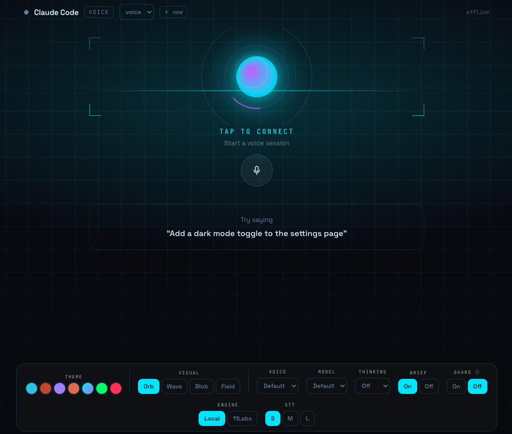

# claude-voice-code (`cvc`)

Talk to **Claude Code** by voice — two-way, with barge-in — from your **terminal**
or a **web UI**.

<p align="center">
  
</p>

`cvc` bridges to a normal, already-authenticated `claude` running in a tmux
session: your speech is transcribed and injected as if typed, and Claude's reply
is read from the session transcript and spoken back — streamed sentence by
sentence. Speech runs **offline** (sherpa-onnx: Whisper + Kokoro + Silero VAD) or
via **ElevenLabs**, switchable per side.

## Features

- **Two-way voice with barge-in** — talk over the agent and it yields.
- **Terminal + web** front-ends (the web UI adds echo cancellation for speakers).
- **Local or cloud, per side** — free offline engines, or ElevenLabs with a key.
- **Streaming replies** — speaks each sentence as it lands; models warm at connect.
- **Guard mode** *(opt-in)* — speaks a confirmation for risky tool calls (`rm`,
  `git push`, MCP tools) and waits for a spoken yes/no; fail-closed.
- **Web console** — themes, audio-reactive visualizers, and live switchers for
  engine, Whisper size, voice, model, thinking level, and Brief.

## Quickstart

```bash
npm install
npm run cvc -- setup     # install tmux, download offline models, write config
npm run cvc -- doctor    # verify your environment

npm run cvc -- start     # terminal: open a Claude session and start talking

npm run web:build        # web UI:
npm run cvc -- serve     #   then open http://127.0.0.1:5173
```

Install globally with `npm i -g .` (or `npm link`) to use `cvc …` directly.

## Requirements

- macOS or Linux, **Node ≥ 20**
- **tmux** and **sox** (`cvc setup` installs tmux; `brew install sox`)
- A logged-in **`claude`** on your `PATH`
- For cloud speech only: an **`ELEVENLABS_API_KEY`**

## Commands

| Command | What it does |
|---|---|
| `cvc setup` | Install tmux, download offline models, write `cvc.config.jsonc` |
| `cvc doctor [--mic]` | Check node/tmux/claude/sox/models/api-key (and mic) |
| `cvc start [--attach <s>]` | Ensure a Claude tmux session, then talk |
| `cvc talk [--open-mic]` | Terminal voice loop (push-to-talk; `--open-mic` = hands-free) |
| `cvc serve [--port N]` | Start the web UI server |
| `cvc inject -m "…"` | Send text to Claude and print the reply (no audio) |
| `cvc download-models [--hifi]` | Fetch offline speech models |

**Terminal push-to-talk:** `SPACE` opens the mic; pause and your turn is sent;
`SPACE` mutes; `Ctrl-C` quits. **Web:** click the mic to connect, then just talk.

## Configuration

Copy `cvc.config.example.jsonc` → `cvc.config.jsonc` and edit (`cvc setup` does
this). Precedence: **CLI flag > env var > config file > default**. Common knobs:
`CVC_STT`/`CVC_TTS` (`local`|`elevenlabs`|`off`), `ELEVENLABS_API_KEY`,
`CVC_PORT`, `CVC_NUM_THREADS`.

## How it works

A turn injects via tmux (`load-buffer → paste-buffer → Enter`); the reply is read
from the JSONL Claude writes under `~/.claude/projects/<cwd>/`, keyed to our
injected message and streamed out through a per-turn TTS queue. Barge-in sends
`Escape` and drops in-flight audio. The web client uses WebRTC purely for the
browser's acoustic echo cancellation. Shared logic lives in `packages/core`
(speech providers, the bridge, the turn-state gateway); `apps/cli` and
`packages/server` are thin front-ends.

## Development

```bash
npm run typecheck
npm test                      # unit tests (node:test)
CVC_AUDIO_TESTS=1 npm test    # + local TTS→STT round-trip (needs models)
CVC_RTC_TESTS=1 npm test      # + real-WebRTC transport loopback
```

The CLI and server run TypeScript directly via `tsx`; `tsc` is type-check only.

## License

MIT — see [LICENSE](LICENSE).
